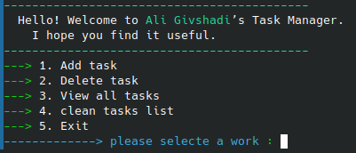

# ToDo-Manager
Task Manager CLI Application A simple terminal-based task manager written in Python. Features include:  Add new tasks  Delete tasks  View all tasks  Clear the entire task list  Automatically save and load tasks  This project is created for learning the fundamentals of Python, file handling, and building real runnable applications.

